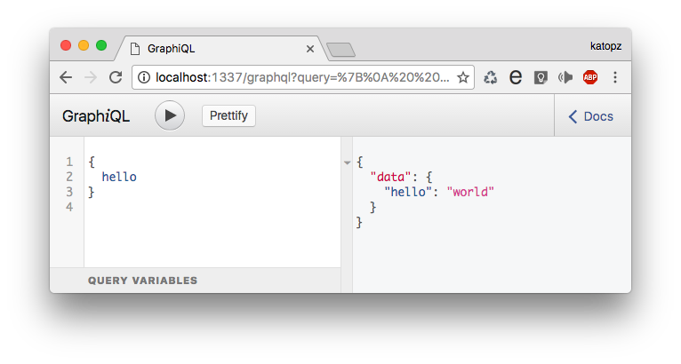

# Docker ❤ Parse
[](https://hub.docker.com/r/yongjhih/parse-server/)
[](https://hub.docker.com/r/yongjhih/parse-server/)
[](https://hub.docker.com/r/yongjhih/parse-server/tags/)
[](https://github.com/yongjhih/docker-parse-server/raw/master/LICENSE.txt)
[](https://travis-ci.org/yongjhih/docker-parse-server)
[](https://gitter.im/yongjhih/docker-parse-server)

## :cloud: One-Click Deploy
[](https://heroku.com/deploy)
[](https://azuredeploy.net/)
[](https://console.aws.amazon.com/elasticbeanstalk/home?region=us-west-2#/newApplication?applicationName=ParseServer&solutionStackName=Node.js&tierName=WebServer&sourceBundleUrl=https%3A%2F%2Fs3.amazonaws.com%2Felasticbeanstalk-samples-us-east-1%2Feb-parse-server-sample%2Fparse-server-example.zip)
[](https://my.scalingo.com/deploy)
[](https://cloud.docker.com/stack/deploy/?repo=https://github.com/yongjhih/docker-parse-server)

## :star: Features
- [x] Parse Server with MongoDB
- [x] [Parse Cloud Code](https://github.com/yongjhih/parse-cloud-code) via git with auto rebuild
- [x] Parse Push Notification : iOS, Android
- [x] Parse Live Query
- [x] [Parse Dashboard](https://github.com/yongjhih/docker-parse-dashboard)
- [x] Tested Docker Image
- [x] Deploy with Docker
- [x] Deploy with Docker Compose
- [x] Deploy with one click
- [x] GraphQL support `GRAPHQL_SUPPORT=true`, `GRAPHQL_SCHEMA=YOUR_SCHEMA_URL` (default to `./cloud/graphql/schema.js`)

## :tv: Overview


## :see_no_evil: Sneak Preview
[](https://youtu.be/1bYWSPEZL2g)

## :rocket: Deployments

> #### Note
* If you are upgrading from version below 2.3.0, please see [these recommended steps](https://github.com/ParsePlatform/parse-server/blob/master/2.3.0.md).

### :paperclip: Deploy with Docker
```sh
$ docker run -d -p 27017:27017 --name mongo mongo

$ docker run -d                                \
             -e APP_ID=${APP_ID}         \
             -e MASTER_KEY=${MASTER_KEY} \
             -p 1337:1337                      \
             --link mongo                      \
             --name parse-server               \
             yongjhih/parse-server

$ docker run -d                                \
             -p 2022:22                        \
             --volumes-from parse-server       \
             --name parse-cloud-code-git       \
             yongjhih/parse-server:git

# Test parse-server
$ curl -X POST \
  -H "X-Parse-Application-Id: {appId}" \
  -H "Content-Type: application/json" \
  -d '{}' \
  http://localhost:1337/parse/functions/hello

$ docker run -d \
             -e APP_ID=${APP_ID}         \
             -e MASTER_KEY=${MASTER_KEY} \
             -e SERVER_URL=http://localhost:1337/parse \
             -p 4040:4040                      \
             --link parse-server               \
             --name parse-dashboard            \
             yongjhih/parse-dashboard

# The above command will asuume you will later create a ssh 
# and log into the dashboard remotely in production. 
#  However, to see the dashboard instanly using either
#  localhost:4040 or someip:4040(if hosted somewhere remotely)
# then you need to add extra option to allowInsecureHTTP like
# It is also required that you create username and password 
# before accessing the portal else you cant get in

$  docker run -d \
        -e PARSE_DASHBOARD_CONFIG='{"apps":[{"appId":"<appid>","serverURL":"<docker-ip>/parse","masterKey":"<masterkey>","appName":"<appname>"}],"users":[{"user":"<username>","pass":"<password>"}]}' \
        -e PARSE_DASHBOARD_ALLOW_INSECURE_HTTP=1  \
        -p 4040:4040                      \
        --link parse-server               \
        --name parse-dashboard            \
        yongjhih/parse-dashboard

```
### :paperclip: Deploy with Docker Compose
```sh
$ wget https://github.com/yongjhih/docker-parse-server/raw/master/docker-compose.yml
$ APP_ID=YOUR_APP_ID MASTER_KEY=YOUR_MASTER_KEY PARSE_DASHBOARD_ALLOW_INSECURE_HTTP=1 SERVER_URL=http://localhost:1337/parse docker-compose up -d
```
> #### Note 
* We use `PARSE_DASHBOARD_ALLOW_INSECURE_HTTP=1` to allow insecure via development environment.
> * `$ wget https://github.com/yongjhih/docker-parse-server/raw/master/docker-compose.yml -O - | APP_ID=YOUR_APP_ID MASTER_KEY=YOUR_MASTER_KEY docker-compose up -d -f - # not supported for docker-compose container`

### :paperclip: Deploy to Cloud Services
* [Heroku + Mongolab Development](ADVANCE.md#getting-started-with-heroku--mongolab-development)
* [AWS Elastic Beanstalk](ADVANCE.md#getting-started-with-aws-elastic-beanstalk)
* [Microsoft Azure App Service](ADVANCE.md#getting-started-with-microsoft-azure-app-service)
* [Google App Engine](ADVANCE.md#getting-started-with-google-app-engine)
* [Scalingo](ADVANCE.md#getting-started-with-scalingo)

## :zap: Advance topics
* [How to use with existing mongodb with DATABASE_URI](ADVANCE.md#how-to-use-with-existing-mongodb-with-database_uri)
* [How to use with existing parse-cloud-code](ADVANCE.md#how-to-use-with-existing-parse-cloud-code)
* [How to use with custom authentication](ADVANCE.md#how-to-use-with-custom-authentication)
* [How to specify parse-server version](ADVANCE.md#how-to-specify-parse-server-version)
* [How to specify latest commit of parse-server](ADVANCE.md#how-to-specify-latest-commit-of-parseplatformparse-server-of-image)
* [How to start parse dashboard as standalone](ADVANCE.md#how-to-start-parse-dashboard-as-standalone)
* [How to setup SSL with letsencrypt](ADVANCE.md#how-to-setup-ssl-with-letsencrypt)
* [How to setup push notification](ADVANCE.md#how-to-setup-push-notification)
* [How to integrate parse-cloud-code image on GitHub and DockerHub](ADVANCE.md#how-to-integrate-parse-cloud-code-image-on-github-and-dockerhub)
* [How to config Docker](ADVANCE.md#how-to-config-docker)
* [How to config Docker Compose](ADVANCE.md#how-to-config-docker-compose)
* [How to import ssh-key from github](ADVANCE.md#how-to-import-ssh-key-from-github)

## :fire: Server Side Developments
How to push cloud code to server  
[](https://youtu.be/9YwWbiRyPUU)
```sh
# This command wil create a SSH keys for you as
#  ~/.ssh/id_rsa.pub and another private key.
# you can leave the options balnk by pressing enter.

$ ssh-keygen -t rsa

# If git container name is `parse-cloud-code-git`
$ docker exec -i parse-cloud-code-git ssh-add-key < ~/.ssh/id_rsa.pub

# port 2022, repo path is `/parse-cloud-code`
$ git clone ssh://git@localhost:2022/parse-cloud-code
$ cd parse-cloud-code
$ echo "Parse.Cloud.define('hello', function(req, res) { res.success('Hi, git'); });" > main.js
$ git add main.js && git commit -m 'Update main.js'
$ git push origin master

$ curl -X POST \
  -H "X-Parse-Application-Id: ${APP_ID}" \
  -H "Content-Type: application/json" \
  -d '{}' \
  http://localhost:1337/parse/functions/hello
```

## :iphone: Client Side Developments
You can use the REST API, the JavaScript SDK, and any of our open-source SDKs:

### :paperclip: curl example
```
curl -X POST \
  -H "X-Parse-Application-Id: YOUR_APP_ID" \
  -H "Content-Type: application/json" \
  -d '{"score":1337,"playerName":"Sean Plott","cheatMode":false}' \
  http://localhost:1337/parse/classes/GameScore

curl -X POST \
  -H "X-Parse-Application-Id: YOUR_APP_ID" \
  -H "Content-Type: application/json" \
  -d '{}' \
  http://localhost:1337/parse/functions/hello

curl -H "X-Parse-Application-Id: YOUR_APP_ID" \
     -H "X-Parse-Master-Key: YOUR_MASTER_KEY" \
     -H "Content-Type: application/json" \
     http://localhost:1337/parse/serverInfo
```
### :paperclip: JavaScript example
```
Parse.initialize('YOUR_APP_ID','unused');
Parse.serverURL = 'https://whatever.herokuapp.com';
var obj = new Parse.Object('GameScore');
obj.set('score',1337);
obj.save().then(function(obj) {
  console.log(obj.toJSON());
  var query = new Parse.Query('GameScore');
  query.get(obj.id).then(function(objAgain) {
    console.log(objAgain.toJSON());
  }, function(err) {console.log(err); });
}, function(err) { console.log(err); });
```
### :paperclip: Android example
```
//in your application class

Parse.initialize(new Parse.Configuration.Builder(getApplicationContext())
        .applicationId("YOUR_APP_ID")
        .clientKey("YOUR_CLIENT_ID")
        .server("http://YOUR_SERVER_URL/parse/")   // '/' important after 'parse'
        .build());

  ParseObject testObject = new ParseObject("TestObject");
  testObject.put("foo", "bar");
  testObject.saveInBackground();

```
### :paperclip: iOS example
```
class AppDelegate: UIResponder, UIApplicationDelegate {
    func application(application: UIApplication, didFinishLaunchingWithOptions launchOptions: [NSObject:AnyObject]?) -> Bool {
        let configuration = ParseClientConfiguration {
            $0.applicationId = "YOUR_APP_ID"
            $0.clientKey = "YOUR_CLIENT_ID"
            $0.server = "http://YOUR_SERVER_URL/parse"
        }
        Parse.initializeWithConfiguration(configuration)
    }
}
```

### :paperclip: GraphQL
Run with GraphQL support.
```shell
GRAPHQL_SUPPORT=true APP_ID=YOUR_APP_ID MASTER_KEY=YOUR_MASTER_KEY SERVER_URL=http://localhost:1337/parse docker-compose up -d
```
> Make sure `./cloud/graphql/schema.js` is pushed to cloud code.  
> Then navigate to [http://localhost:1337/graphql?query=%7B%0A%20%20hello%0A%7D%0A](http://localhost:1337/graphql?query=%7B%0A%20%20hello%0A%7D%0A)  



## :eyes: See Also
* https://github.com/ParsePlatform/parse-server
* http://blog.parse.com/announcements/introducing-parse-server-and-the-database-migration-tool/
* https://parse.com/docs/server/guide#migrating
* https://hub.docker.com/r/yongjhih/parse-server/
* https://github.com/yongjhih/parse-cloud-code
* https://hub.docker.com/r/yongjhih/parse-cloud-code/
* https://medium.com/cowbear-coder/migration-of-parse-server-with-docker-part1-87034cc29978
* https://github.com/yongjhih/docker-parse-dashboard
* [Docker ❤ Parse](https://medium.com/@katopz/docker-parse-782d27761e24)
* [DigitalOcean ❤ Parse](https://medium.com/@katopz/digitalocean-parse-e68d8b71e8eb)

## :thumbsup: Contributors & Credits
[](https://github.com/didierfranc)
[](https://github.com/ArnaudValensi)
[](https://github.com/gerhardsletten)
[](https://github.com/acinader)
[](https://github.com/kandelvijaya)
[](https://github.com/mjdev)
[](https://github.com/vitaminwater)
[](https://github.com/euklid)
[](https://github.com/walkerlee)
[](https://github.com/chainkite)
[](https://github.com/cleever)
[](https://github.com/katopz)
